**Total time spent: 108h**

# June 21st: Preliminary BOM and Layout

Hi there! This is the first time I've ever documented my journey in anything. After making and submitting my first ever PCB in the solder workshop (I think that's what it is?), I decided to follow the hackpad tutorial BUT with a twist. I wanted to make a modular macropad. That's it. Just pushing myself to learn new stuff.

Right now, I have a preliminary BOM and layout that's a mix of the solder tutorial, the hackpad tutorial, and my own ideas. It's just for the main pcb for now. I'll probably update it as I go.

## Preliminary BOM

| Item | Quantity |
| ---- | -------- |
| 1uF Ceramic Cap | 9 |
| 4.7k Ohm Resistor | 10 |
| 220 Ohm Resistor | 1 |
| 10k Ohm Resistor | 1 |
| 6mm THT Button | 1 |
| SPST x3 Dip Switch | 1 |
| XIAO RP2040 | 1 |
| Oled Display 128x64 | 1 |

## Schema Layout

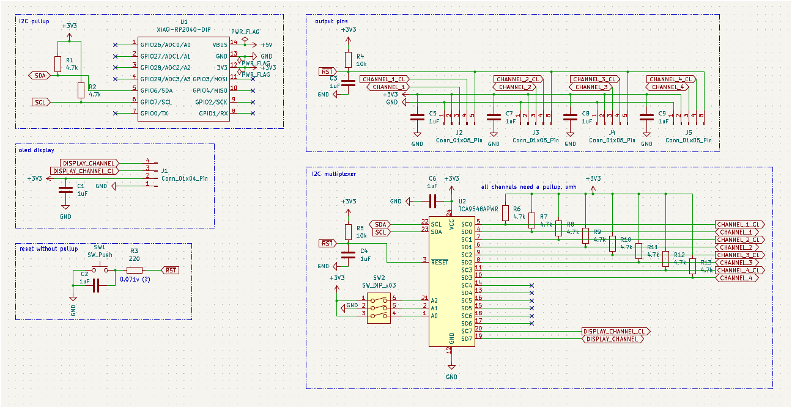
---

gotta love making something complicated for me after doing a beginner tutorial for the first time.

**Total time spent: 5h**

# June 22st

The main module will use an RP2040 as the MCU, with an I2C multiplexer, a 128x32 OLED screen, and keys (because, you know, macropad). A requirement I set for myself is not to use interrupts and that it'll try to make it daisy chainable and be able to do hot swapping.

At first, I thought I needed a dip switch to set the I2C address of the multiplexer. In I2C, the master talks to slaves by address, and you can’t have two devices with the same address. It's the main reason I want to use a multiplexer. I just realized we don’t need the dip switch to set the multiplexer address as I won't have more than 1 in the macropad.

Plus, I added the actual macropad matrix to the circuit and I decided to not add any LEDs to any of the board. That includes the main module and the modules.

**Total time spent: 2h**

# June 23rd

After reading a the documentation for the i2c multiplexer I chosen, I scaled down to a TCA9546APWR from a TCA9548APWR. Eight channels is too much for the main module; four is enough for the three sides with pins and the OLED screen.

Still I have no idea how to begin making the modules. The only good thing is that once the basis is set, it’s just copy-pasting and tweaking the moving parts.

**Total time spent: 1h**

# June 24th

I've started making the modules! I'll be using multiplexers for daisy-chaining everything. In every module, I’ll have a
multiplexer for the I2C bus connected to the 4 header pins and the mcu of the module. That means that I scaled up from
the TCA9546APWR to the TCA9548APWR in the modules because I didn’t have enough channels! It’s just a tiny change, and
the main module isn’t affected. I also be probably be using a attiny1616 as the main mcu for its cost and performance.
Cool nonetheless.

**Total time spent: 4h**

# June 26th

I swapped all modules to use 5V logic only. The TCA9546APWR lets you use 3.3V logic AND 5V logic in the channel side, letting you have a transparent translation layer between these two logic levels.

I also added a i2c buffer chip, the TCA4307, to the modules to compensate with the "long" distances of the i2c bus, keeping the capacitance in the right spot.

I also got really stuck figuring out how the modules decide which of the 4 SDAs and SCLs to use for their internal multiplexer (for daisy-chaining). Ended up using an analog switch controlled by another ATTINY1616. I didn’t want to make it too complicated.

**Total time spent: 2h**

After planning out the way i'll be chaining the modules I swapped all I2C pullups for 1.8k ohm because long distance and the use of i2c fastmode (Before I was going to use the standard mode). Plus, 1.8k ohm is compliant for I2C fast mode at 5V (I might be misunderstanding this, but hey am trying!).

I also considered swapping our I2C buffer chip for a cheaper version. The TCA4311A is basically the same as the TCA4307 but without stuck bus recovery. Its like downgrading from premium to basic without ads.

The I2C buffer will be plugged right into the multiplexer and will be using the SDA and SCL pins chosen by the analog switch. Its quite simple actually. I was really stuck on figuring out how to do it, but I think I got it.

The plan for the ATTINY1616, now named Helping Hand, is to choose a SDA and SCL line via the analog switch and then go into standby mode. According to the ATTINY1616 datasheet, the standby mode retains the state of the GPIO pins with an optional interrupt to wake up from the sleep. Which am probably not going to use, am just going to leave it in standby mode until the module's power is cut (unplugged).

**Total time spent: 4h**

# June 29th

I was really, really wrong. I just tried to brute force it without even thinking. That's what happens when you are new at this! It isn't bad to restart part of a project because that's how someone learns.

There’s an easier way: scrap the mux from the modules and let the module (slave) start with a default I2C address that will be changed by the master when it detects the attiny1616.

Plus, the new approach includes just connecting the SDA and SCL lines to all pins and use a timeout to activate the now-named AUX/MASTER line which will be used to say "HEY!!! THIS IS THE PATH TO THE MAIN BOARD!!! FOLLOW ME!!!". yup.
To pull up these master lines I'll be using a P-MOSFET, as I think its easier than to pullup it via the poor helping hand.

And about the Helping Hand, it has been swapped by a ATINY414 because of it's size and the amount of unused pins I had before. Its only job is to take 4 pins in, give out 3 pins (2 for analog switch, 1 for PMOSFET to pull up master lines).

I have to add, I might have added too much pullups in every part of the line. I'll keep as my final task when I finish the part that all modules share to cleanup the use of pullups in places they are not needed.

**Total time spent: 17h**

# July 1st

Holy bananas. I really finished the common module schematic. I have separated it into its own file and my god that's so hecking great! Now the actual modules, like knobs or sliders, are the ones who need the baking! I hope its easier lol.

Lets see... The new approach was converted into the common module schematic. The common module schematic has everything a module needs to have to actually work as one. It has everything I showed earlier but I added 4x 2 channel analog switches to choose if I want to open a path to that side of the board or not (Left, Right, Up, Down).

The candidate for the job is a TS5A23167 which is a analog switch that is normally closed. For it's operation am using only one gpio pin for each one. This means the IN1 and IN2 pins are connected to the same pin. Its a way to save up pins for the now consumed attiny414.

I also cleaned up the use of pullups in the common module schematic thanks to the analog switches being "transparent" to the pullup. Just so they didn't need to be pulled up in each stage they pass through. Plus, swapped EVERY pullup resistor for a 4.7k ohm resistor, the ones I had before wouldn't have cut it.

Ah, and I almost forgot. To flash these modules you need to have some kind of header or way to connect into the UPDI pin of the attiny chips, right? My first choice was to have two separated headers for the chips: one for the helping hand and one for the actual chip that does all the work. But then I thought, why not just have one header for both? Its a lot easier to wire up and it's just a matter of having the helping hand connected to the UPDI pin and the actual module connected to the other side with its UPDI pin. So, I ended using that with a SPDT switch to choose what UPDI pin is being used. Nice job me!

Now, I'm going to start by doing the knobs module thing.

**Total time spent: 6h**

# July 4th

Took a while to start (procrastination lol), but behold: the finalized PCB for the Knobs in only one day! Used 4 layers as I couldn't route all tracks with 2. Might be wrong, might be right. But I still repeated the process like 6 or 7 times to find a good way to route the tracks. But I think it led to a better design (I think it looks good), so am not that mad about it.

Oh! And somehow I forgot about adding the mounting holes! At least the majority of the chips and tracks were not routed near the corners of the pcb. It was an easy fix though. The mounting holes are m2 if you were wondering.

**Total time spent: 9h**

# July 5th

Started checking LCSC parts and prices for the BOM. Found a cool KiCad plugin for an interactive BOM (it does what it says).

Because I just want to apparently procrastinate, I'll just search up all the components in LCSC and add a somekind of field so it appears in the interactive BOM.

**Total time spent: 30min**

I don't think is a good idea to have a component is backorder. It's the 1 channel analog switch that I'm using. uhm, I'll just continue using it. I don't know if it is really a bad idea or not. I'll continue putting the LCSC part number in the parts.

**Total time spent: 1h**

The slider module was pretty easy to route and make. I practically just had the whole thing in already on my mind.
In the start everything was crammed in the middle. Then I thought "is the footprint right" because the slider I was going to use DID NOT match the one I found in KiCad. In the I used easyeda2kicad to convert the footprint and get a pretty 3d model for it. It will be quite useful when I get into fusion360 making the cases and all of that.
(If you though I didn't redo the routing you are really REALLY wrong. Redid it 4 times until getting a pleasing result for my self)

I also decided to add date, "company" and title to all the schematics of the boards. Makes them pretty.

**Total time spent: 3h**

Now I need to decide if I want to make first the firmware for each module and main pcb or make first the cases for the main pcb and then the modules.

# July 6th

And just like that the decision has been made. I'll make the cases first and then the firmware.
BUT, before actually start to make the cases, I needed all the components with a 3d model. Its mostly just search in GrabCad, download and tada. For a real moment got stuck on the magnetic connectors models which I was going to buy from AliExpress (AliExpress rarely or never gives CAD files I guess), but nonetheless I was saved by a russian user on GrabCAD. what a great day to be alive.

I assigned the models to the pcb components so they are visible in the export step file.

**Total time spent: 2h**

For some reason when I was exporting the PCBs for Fusion 360, mr kicad was throwing at me a weird error: "Could not add 3D model to (component ref). OpenCASCADE error: TDocStd_XLinkTool::Copy : not self-contained." The first solution that came to my mind was to simple reexport the 3d models by importing them into fusion and then exporting them from there. And ta-da it worked. Won't question it.

**Total time spent: 20min**

With that said I decided to start by making the case for the main pcb. I will be screwed by the bottom to not show any screws. It will be using m2 screws and inserts. And that's it. Time to get into work.

# July 7th

For the love of god I cannot figure out how to make the holding plate of the keys. I spent 2h fighting and searching for tutorials. All of them explain the "why" but not the "how" of positioning. Got mad and decided: no holding plate, just a big rectangle hole.

**Total time spent: 2h**

Fusion360 is hard to use as a beginner, I mean am getting better at it but there's that.
In the end I tried adding the keyswitch plate by following a hybrid of tutorials and my own ideas.
BUT, god dammit the luck I have. Turns out I put the holes of the main board too close with the keyswitches and now the top part of the case cannot be screwed in. GREAT. I'll need to widen it just so the modules don't need to be modified in any way.
The only good thing I get from this is that I'll be faster next time using this hecking program.

**Total time spent: 7h**

# July 8th

Had the case practically finished... I just restarted again because I found another problem. I forgot the cutouts in the pcb for 2u key stabilizers! The solution is to just mount stabilizers into the keyplate. No way I'm redoing the other PCBs for height...
In reality the main reason to restart the whole case design was that the case was a big bit ugly.  :(

**Total time spent: 5h**

# July 9th

Finalized the main module case. Finally. I'm so happy. I'm going to sleep now. yippie.
I mean, it looks good! (in my eyes) The modules would just be a copy paste of the main module with different proportions... and holes positions.
**Total time spent: 6h**

# July 10th

And just like that, I finished all the cases in one day. Now it's time for firmware.
I was planning to use platform io (arduino) for the modules (main mcu and the helping hand) and use the kmk firmware for the macropad because it seems to be quite easy to modify it to add support for my knobs and sliders. Plus, macropad support lol.

**Total time spent: 8h**

I was looking at the cases with the boards in fusion360 to see if they match as they should. And what would you know, one side of them didn't. The right side (in kicad's pcb editor) header in all pcbs was the wrong way around. Imagine if I submitted this and sent it to the fab with that error. mama mia.

And also, remember the chip that was in backlog? Yeah, it is NOT good have something in backlog. I just swapped it with the equivalent chip. The normally open one, the TS5A23166DCUR. Thank god that they have the same pinout or else I would be pulling my hair out of my skull.

**Total time spent: 1h**

# July 10th

Started with the firmwares and finished one already!
I'll be making first the helping hand (ATTINY414) firmware. Then the knobs, sliders (ATTINY1616s) and finally the main module (RP2040).

1 out of 4 firmwares done. The helping hand firmware was easiest. Just some logic, then deep sleep.

**Total time spent: 45m**

2 out of the 4 firmwares done. The knobs one was a little hard to make because of the need to make a base class that would be used to setup comms and do base commands like the change address command. The same class and protocol will be used for the sliders.

**Total time spent: 3h**

3 out of the 4 firmwares done. The sliders one was quite easy to make. Just read a analog value and send it through comms. Pretty nice.

**Total time spent: 1h**

# July 12th

Alright. The macropad firmware is done. It was actually the hardest part. Because I wanted to make a dynamic system that would be able to handle directly the modules with more than one slider or knob, and I had to make a system that would be able to handle that.
At least its done and I won't ever touch it again. I can now recognize and use if more than 3 knobs or sliders are connected to the macropad or if a module it self has 3 sliders or 27 knobs.

The denseest part of the firmware is (and will be) the handling of the modules, discovering them and health keeping them.

One of the things that got me stuck for a moment was the screen driver. Because it needed directly a i2c bus and addr. The addr is comprehensible but the bus part won't work because am using a multiplexer and I need to choose a channel before letting it use the bus. The solution was to just "borrow" the way adafruit made their own class for a similar multiplexer. It practically clones the bare basic methods to make it work with the selected channel and act as a i2c bus. Quite a simple solution. Would have overengineered it.

AND NOW THE QUESTION: will it run in real hardware? ohoho, am scared.

**Total time spent: 15h**

# July 13th

I've been preparing for submitting the project to undercity's form and see if I can get it approved. If so, I'll be so fucking happy for having made something that is so cool and maybe useful as my second project. And even if I don't get approved am quite proud of myself for making it!

The preparations include:

- Decorating the pcb with silkscreen
- Decorating the cases
- Rerouting the main board to make it a little prettier
- Adding comments to methods in the Macropad's firmware
- that's it.

**Total time spent: 1h**

One thing that I sadly failed to do is to make screenshots of the progress to add here. I just added that mere screenshot at the start and that's it lol.
I'll compensate it with the following screenshots of the finished product :) (sorry)

## Finalized PCB layouts

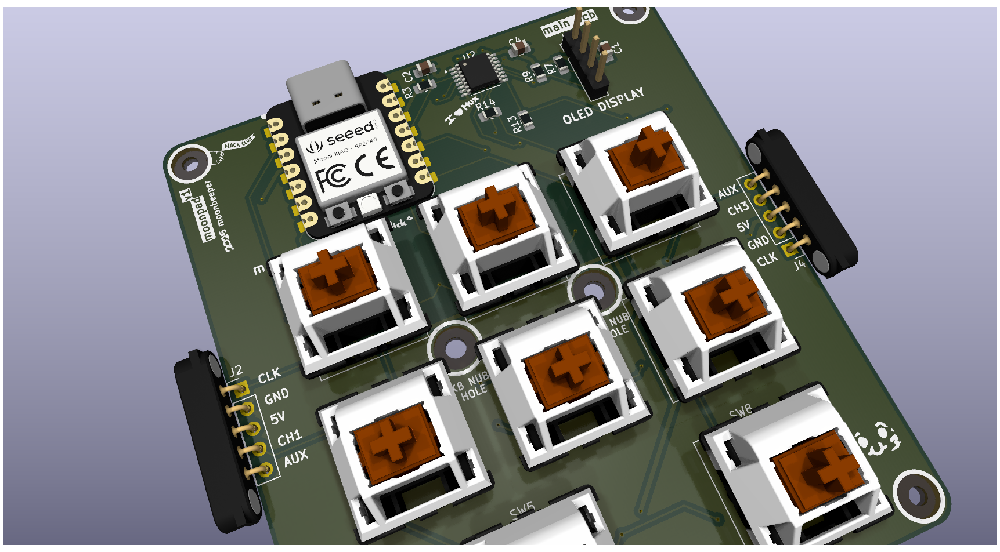
> Macropad

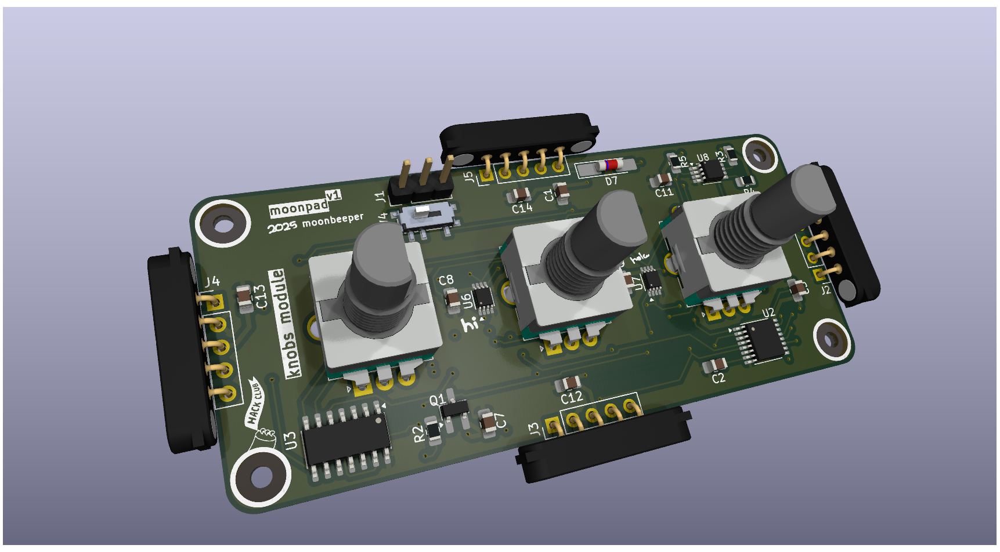
> Knobs Module

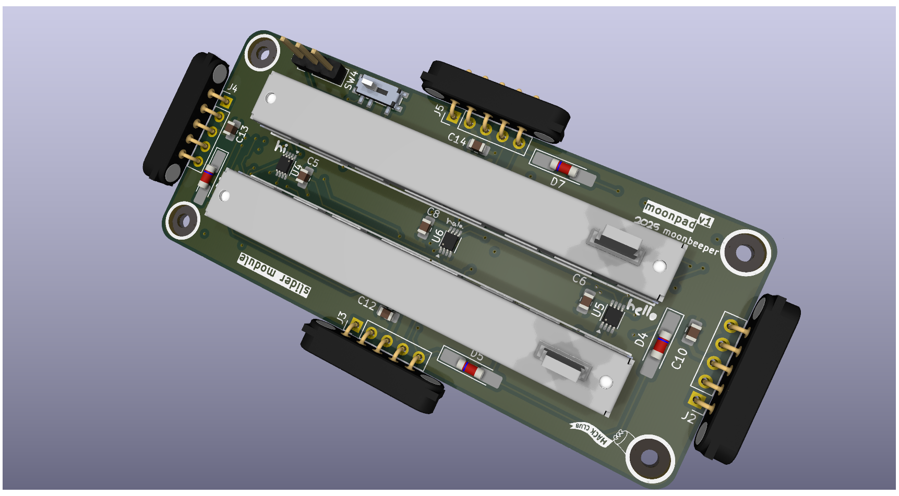
> Sliders Module

## Finalized Schematics

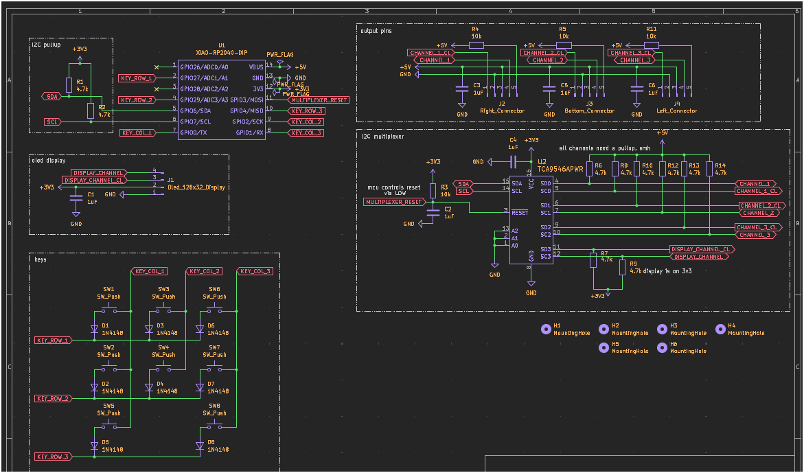
> Macropad

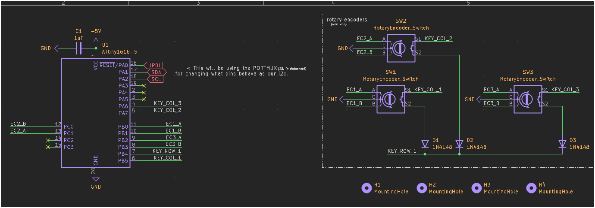
> Knobs Module

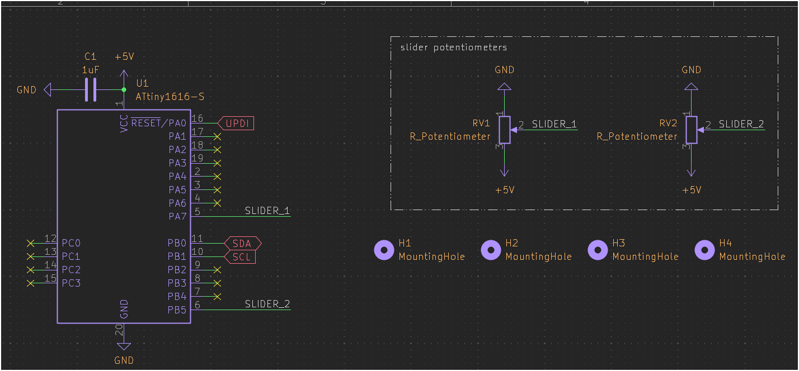
> Sliders Module

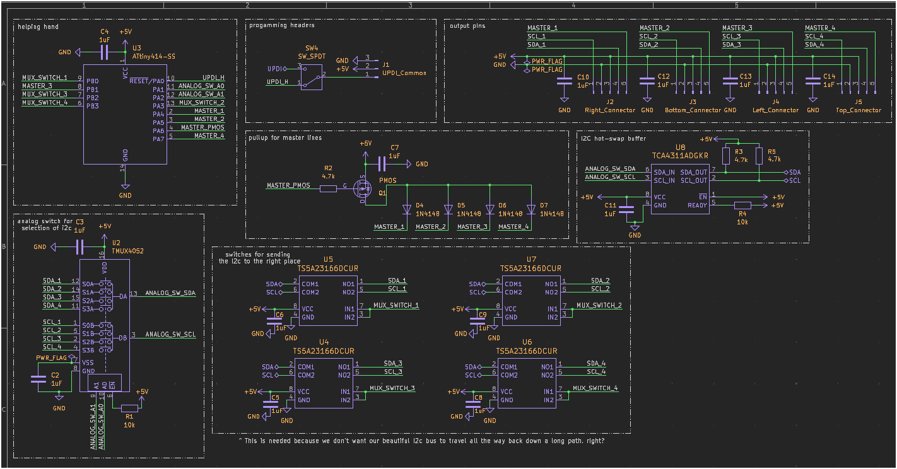
> Common Shared Module Part

## Finalized 3D models

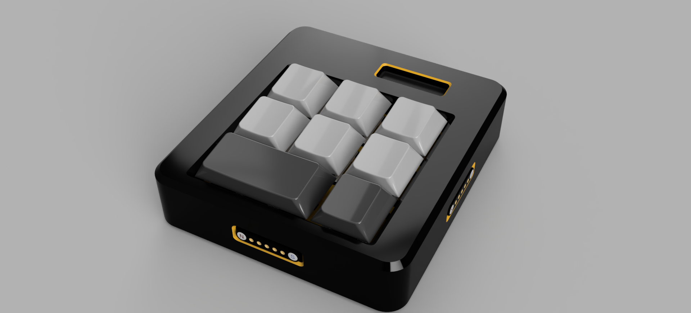
> Macropad

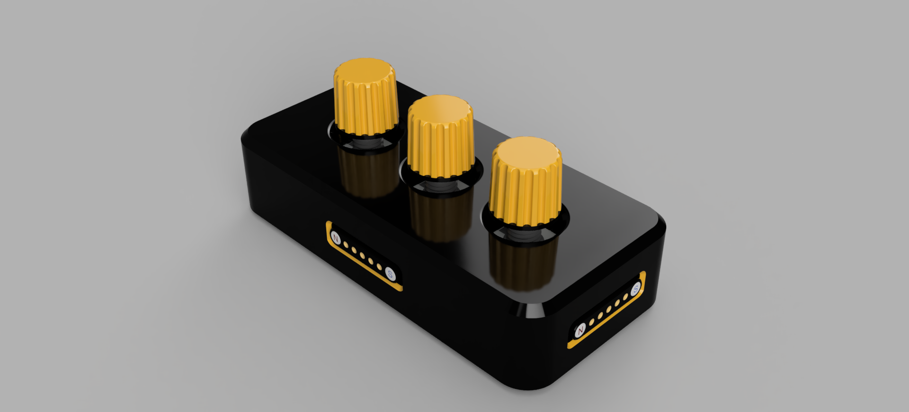
> Knobs Module

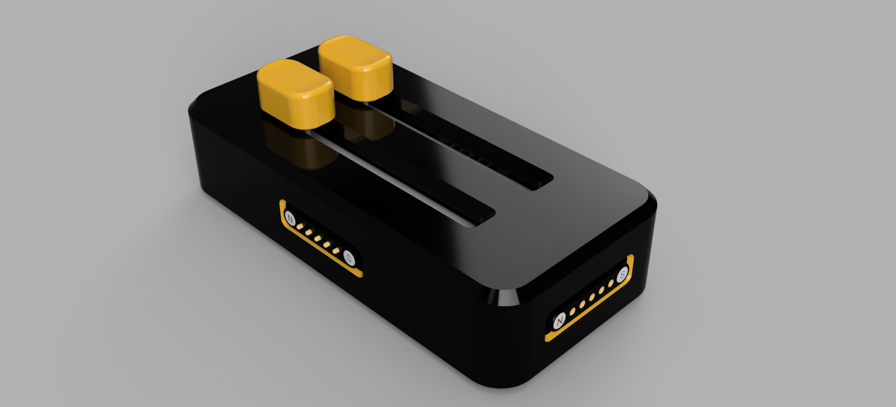
> Sliders Module

**Total time spent: 20min**

Seems like have discovered why fusion360 was asking for a "Version description" each time I was saving the project. Its for version control... I'll add screenshots of the failed try to make the Macropad in here to not modify the journal.

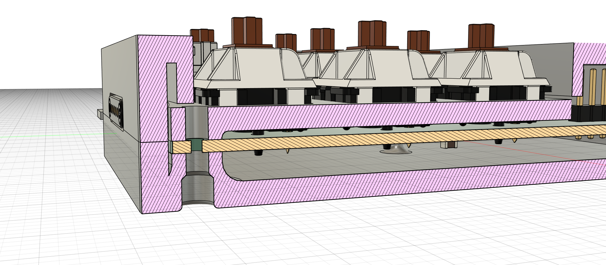
> Failed attempt to make the top case because the keycaps + switches were colliding with it.

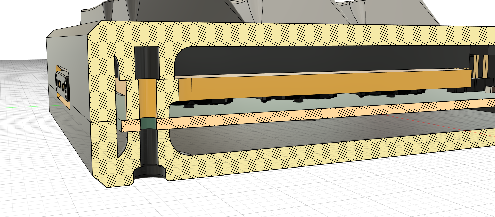
> The final result where the PCB was widened to fit the keycaps + switches with the m2 holes.

**Total time spent: 10min**

Woaaah. I forgot about one thing!! THE BOM!! Its in the BOM.md file, obviously. This hecking thing is pricier than I though. If I get approved I'lk be possibly over the budget. mama mia.

I've removed the original DSA keycaps and replaced them with a cheaper option as I was just getting a whole keyboard of keycaps when I won't even use them in the macropad. It might even be risky as I'll be using sellers that aren't very well known.

**Total time spent: 1h**

Shall I thank the gods of the hackclub's solder workshop for the kickstart it gave me to start my own projects like this. :3

# July 19th

Big woops from me. I didn't realize that I had forgotten to remove some of my placeholder text used for the graphics in the pcbs. Found about it thanks to the preview JLCPCB gives you when uploading gerbers. lol

I've also moved some of the footprint references (text) to make it prettier in my eyes.

**Total time spent: 20min**
