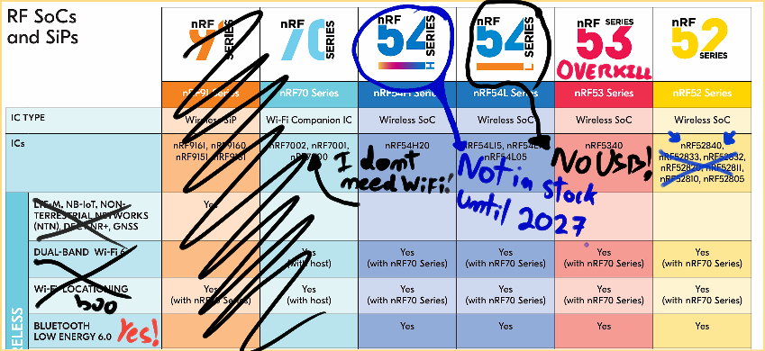
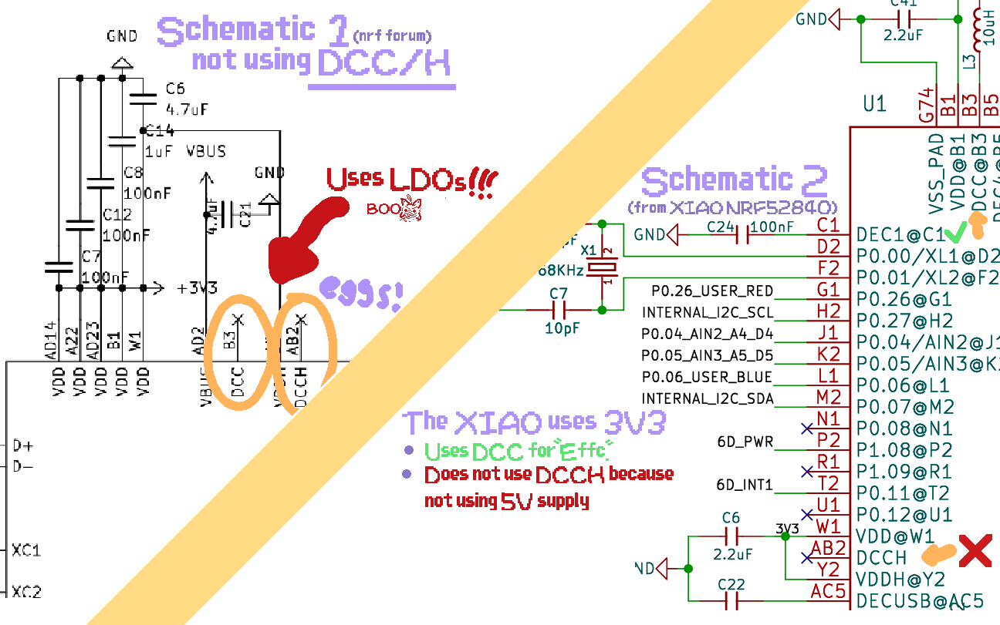
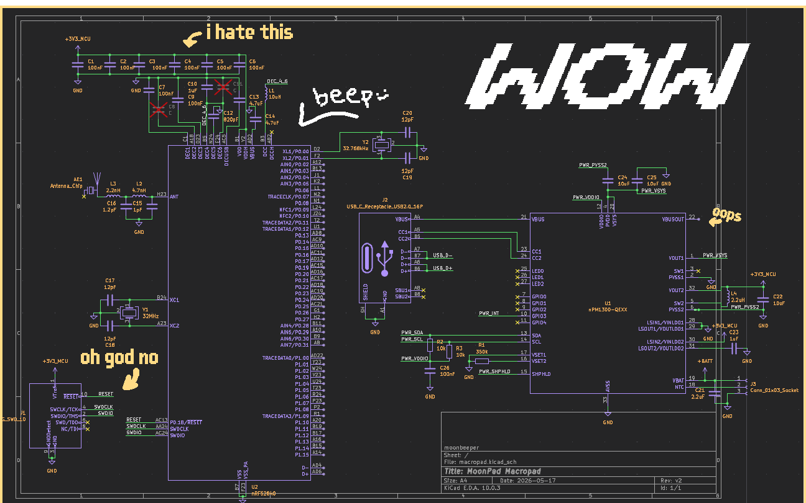
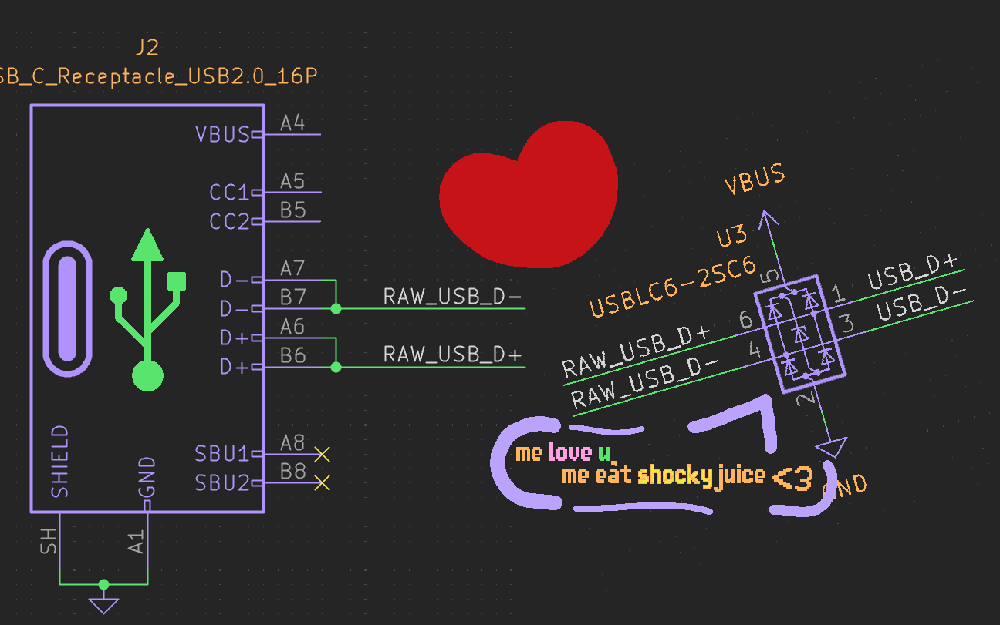
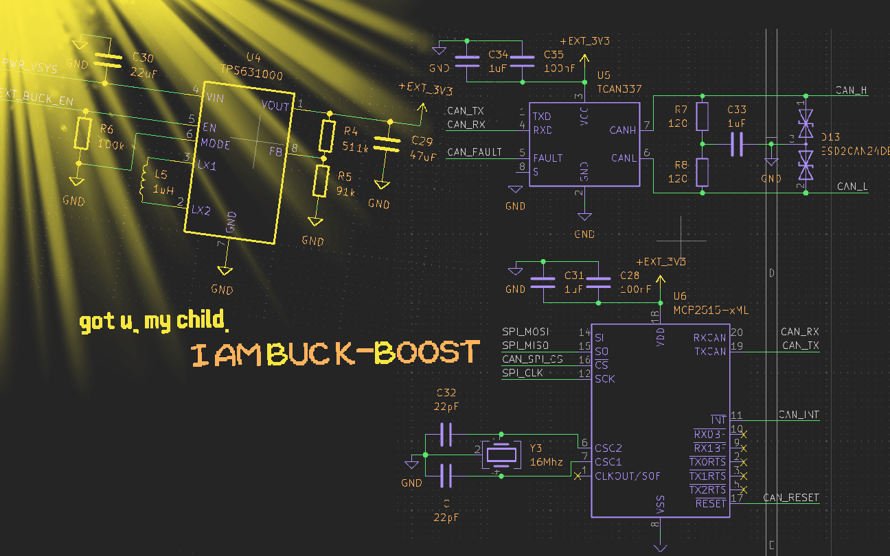
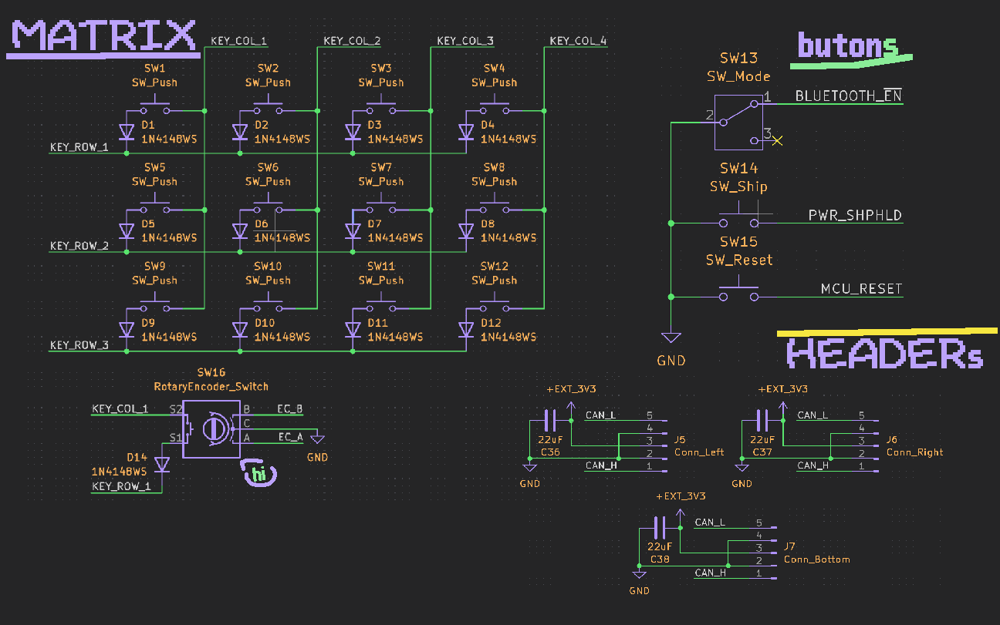

# May 16: The BOM and approximate architecture

While practically all the research was done before to make my t1 pitch (this is not a t1 project. I really don't know why I though that while i was researching), I am going to regurgitate it here for the sake of making a journal entry for my beautiful t2 project.

Right, ALL of this comes from me wanting to make a modular macropad with my first try being a complete failure (not on the macropad department, instead on the modular one) because of me not really paying attention at the obvious signs that it really couldnt work how I wanted it to work. It might had worked if I hadnt used analog switches for the i2c stuff... who knows.

First of all, good bye I2C and hello can bus (even though I think I will be using it wrong) for the communication between the mainboard (macropad) and the modules. 
The current plan for this thing is to make the mainboard just listen to updates coming from the modules by using interrupts from the canbus controller instead of polling like in the i2c version (more sleep!!!). While modules just send updates when they need to, and thanks to mr canbus they can do it at the same time because of the arbitration included with canbus. I will also be using my own teeny tiny protocol for the communication between the mainboard and the modules, for example, the typical handshake using the unique id of the module and what they have to offer (buttons, knobs or sliders) and then the mainboard will just do the rest of the magic (and also a keep alive by the modules to let the mainboard know that they are still there).

The mainboard (macropad) will be using the NRF52840 as the brains to provide both USB (first priority) and Bluetooth (second) via the comp usb stuff (to let you configure it via serial and still be a hid device) with a npm1300 as the power management for only feeding the mcu. Because the canbus controller, transceiver and the modules will be fed by a buck boost (probs these tps from ti for 1.5A) from the vsys of the npm1300 to leave alone the nrf52840 "clean" power wise from the canbus spikes and hungry modules.
As for the modules, I will simply be using a STM32G0x1 to be able to remove the can controller becuase its integrated into the mcu.

I only have planned modules like the knobs (classic ec11), sliders (pots) and maybe a big knob encoder (??, probbaly not because there's a chance I go over the budget with my hours... and deducted ones lol). But the idea is that the modules can have whatever you want, as long as they have a canbus connection and tell the mainboard what do they have to offer (knobs, buttons....).

Sadly I wont be using ZMK for this project because of its static device tree, which is a big no no for this project because of the dynamic nature of mah modules. Instead, I will be using pure as water Zephyr to make the firmware for the mainboard and the modules... which will be hard and not fun anymore and i will be screaming and crying and rethinking my decision of not using ZMK and making a frankenstein firmware or even worse, not using a esp32 to be able use arduino stuff... Bah, I like to suffer, what can I say :3.

AH, and let's not forget that I WILL not be using those rgb gamer leds because of probable power constraints because I want to use this via bluetooth and that needs a battery (not huge please), and those things are very power hungry (at max brightness. not that i would run them at max brightness). And that I will be using an oled screen to have (i hope) "a pretty boot screen" and the battery status stuff. GOD now i want to add a tiny buzzer to make stupid sounds lol.

As for final words, gosh how I'd liked for past me to make a thousand different screenshots (or use lapse... nope) to justify my hours spent in researching. WELL, have this beautiful screenshot of the uhh nRF comparison table showing me saying "no, no, no, no, yes":

**Total time spent: 4 hours**

# May 18: Baby steps of the first schematic

ah, it's been a long time. How have you been kicad? still crap in wayland? yes you are still crap in wayland... oh, hello again bimbows!

While it should be reallllllly easy to follow the reference circuits, I sometimes get into a... uhh a loop? 
Because, instead of choosing one of the provided configurations from the nRF52840, I tried to research and find other schematics that used it WITH a pmic like the npm1300. And I really did not find much, just the XIAO devboards that did not adhere to the provided configurations.

And that's where my brain imploded a bit, because of it not using one of the provided configurations by nRF I started to search why is it like that and if I should copy it (because it has been proven to work) and blah blah blah. In the end I did just copy the stuff and that's it.

It uses the DCDCEN1 and not the DCDCEN0. What's DCDCEN? Its to enable the DC/DC regulators to have, overall, better efficiency and less power consumption than using the, by default, LDO regulators that do not need anything on the DCC or DCCH (H of High Voltage 5v) pins. To be able to use them I need to HAVE a LC filter or else pee pee poo poo no worky, and because I am using 3v3 for powering the mcu I am not using the DCCH and only the DCC. Its just for the radio stuff (eg. Bluetooth), and uhh indeed I did just copy the XIAO schematic but at least I know why I should copy it instead of just copying it blindly.

i don't really draw well but i try hahahahh :)

Meanwhile on the npm1300 land, I just "followed the reference circuits" and that's it. I mean I did get a bit confused at how I can set an interrupt (USB disconnected (vbus) and SPHOLD (wake from sleep button)) to a GPIO of the pmic and finally found the solution on the nRF sdk. They, quite literally, had that as an example of usage with the npm1300. pretty cool not gonna lie. I won't be using any of the leds (drivers) as I plan to actually use the oled screen for showing stuff (who would have thought that) and then sleep to save battery (woowie).

... I do be starting to think that I do need to use lapse because I do be derailing from making the schematic to researching other stuff and bleh. but i do be using a stopwatch for these things.

OKAY, here's a baby baby baby schematic of my macropad that doesn't even have the macropad part and just has the nRF and PMIC in it with some text pointing to the caps of the vdd because stupid me couldnt count and got confused in that part somehow.

now gotta do the key matrix and some easy quick things like adding an external flash and the canbus stuff and yay. cleanup and then suffer making the pcb... and also think how the heck will I get a J-Link thingy to program these stuffs

**Total time spent: 1.7 hours**

# May 23: About time for the keyboard matrix and the first finished schematic

wow. i hope forge gets the git branch feature. like, my beautiful images!

I added the typical USB esd protection to not fry alive the nrf52840 thanks to mr usb c shenanigans. look at it next to its partner, the big usb c connector. its so cute and tiny and cheap and it will protect my precious nrf from the evil usb spikes and the spell named electrostationic dischargium.

okay, now WHY did I add the additional buck feeding from the VSYS of my PMIC!? first TI made a cool buck(-boost) that has a soft-start (to not pull too much and make the pmic go crazy) and other features that i wont even use. I practically chose it for its 2MHz switching frequency to try to mimic the PMIC (it doesnt even reach the 3.6MHz switching it has) with its hysteretic mode (also called hysteric mode. means lower than 2Mhz) that automagically switches to PWM mode (max frequency in high workloads), and uhh to also lie to my self that if I hadnt chosen the 2MHz one it would make the bluetooth radio go pee pee poo poo. AND AND also because the VSYS line might drop below the 3v3 that I use for everything (drops higher voltages to 3v3 and boosts to 3v3 when vsys is lower than the target (3v3)) or else everything will be sad and tell me "hey, i am going to brown out and die... heck you".

Its ONLY job is to give food to my canbus controller, transceiver and the modules... those pesky power hungry canbus chips (the modules themselves don't really eat that much). Even though we can't really reach its max of 1.5A because of limits on the vsys. we wouldnt really reach it anyways

Plus another reason is because the BUCKS inside the pmic can't really provide more than 200mA and... that's not enough for mr canbus guys...... If this board catches fire and implodes (not explodes) i am going to cry and blame the world and not my brain for the wrong choices.

VISUAL DEPARTMENT INCOMING (without image). its just a nice!view because of, again, the beautiful power savings that won't be really noticeable and the fact that it doesnt have a backlight... but its cool and that's it. I mean I can decide to swap it with a normal SSD1306 oled because the pin configuration stays practically the same (if I still use SPI!)

... the nice!view isnt really that cheap. god now I am starting to think that I am actually taking the nice!view for the sake of having it bruh.

LASTLY, the keyboard matrix. I am not going to talk about it because its quite literally just a matrix with diodes and stuff. I mean, if you have ever seen a keyboard schematic, you know how it works. And also you have the uhmm button and spdt switch that will control the bluetooth stuff. I plan to do the pairing and other stuff by using the knob with the screen... lets not forget about the connectors that are just the 3v3 and canbus lines.

WAIT WAIT WAIT, I also saw (snooping) in the slack channel of forge someone talking about needing to put a cap and a resistor in parallel between the usb shield and the ground plane to reduce the risk of a mega shock killing the macropad (and maybe the user idk)... my case is made out of plastic, there's no exposed metal frame (like aluminum or something) to touch. I don't need that. If a mega shock somehow finds its way inside, its just going to pass through the ground planes straight to narnia anyway.

**Total time spent: 3.5 hours**
