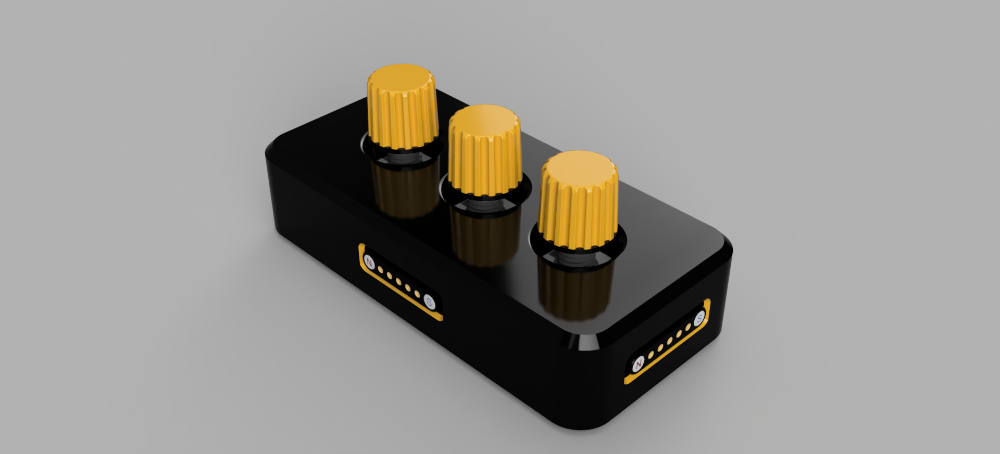
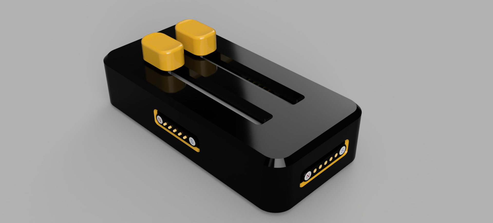
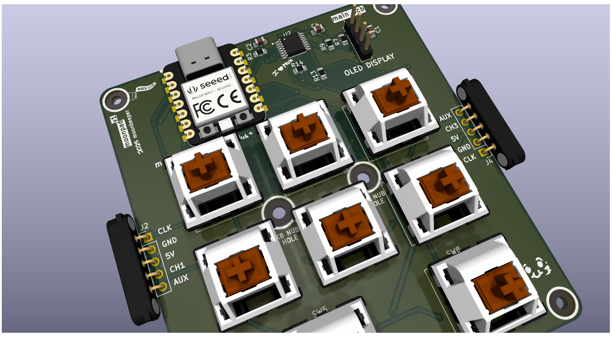

# moonpad

It's a modular macropad. Simple as that. You have a screen in the macro pad and 2 modules that can be daisy chained and hot swapped.

The primary reason for making this project was to just learn how to make PCBs and use microcontrollers like the RP2040 and ATTINY. It was a great adventure and I think I learned a lot. I mean, there's sure a lot of room for improvement but I'm happy with the result.

## Images

> Macropad

> Knobs Module

> Sliders Module

> Macropad PCB

> Knobs Module PCB

> Sliders Module PCB

## BOM

> **NOTE:** This is a copy of the BOM.csv file. The shipping cost might be actually higher than the price listed here.

| Item | Quantity | LCSC Part Number | Cost EUR | Cost USD | Link |
|---|---|---|---|---|---|
| 1uF Ceramic Cap | 34 | C116352 | 0,49 € | $0,56 | <https://lcsc.com/product-detail/Multilayer-Ceramic-Capacitors-MLCC-SMD-SMT_Samsung-Electro-Mechanics-CL21B105KAFNNNE_C116352.html> |
| 4.7k Ohm Resistor | 16 | C60816 | 0,20 € | $0,22 | <https://lcsc.com/product-detail/Chip-Resistor-Surface-Mount_YAGEO-RC0805FR-074K7L_C60816.html> |
| 10k Ohm Resistor | 8 | C17414 | 0,16 € | $0,18 | <https://lcsc.com/product-detail/Chip-Resistor-Surface-Mount_UNI-ROYAL-Uniroyal-Elec-0805W8F1002T5E_C17414.html> |
| 1N4148 Diode | 19 | C68883 | 0,55 € | $0,63 | <https://lcsc.com/product-detail/Switching-Diodes_Vishay-Intertech-LL4148-GS08_C68883.html> |
| TCA9546APWR | 1 | C201653 | 0,63 € | $0,73 | <https://lcsc.com/product-detail/Signal-Switches-Multiplexers-Decoders_TI-TCA9546APWR_C201653.html> |
| Cherry MX Red Switch | 8 |  | 5,72 € | $6,68 | <https://es.aliexpress.com/item/1005006255961111.html> |
| XIAO RP2040 | 1 |  | 6,25 € | $7,30 | <https://es.aliexpress.com/item/1005004459618789.html> |
| Oled Display 128x32 | 1 |  | 1,97 € | $2,30 | <https://es.aliexpress.com/item/1005008640132638.html> |
| 5 pin magentic connector | 11 |  | 3,13 € | $3,66 | <https://es.aliexpress.com/item/1005006531774076.html> |
| TS5A23166DCUR | 8 | C49148 | 3,85 € | $4,42 | <https://lcsc.com/product-detail/Analog-Switches-Multiplexers_Texas-Instruments-TS5A23166DCUR_C49148.html> |
| ATTINY1616-SNR | 2 | C609652 | 2,69 € | $3,09 | <https://lcsc.com/product-detail/Microcontrollers-MCU-MPU-SOC_Microchip-Tech-ATTINY1616-SNR_C609652.html> |
| TMUX4052PWR | 2 | C7362466 | 0,69 € | $0,80 | <https://lcsc.com/product-detail/Analog-Switches-Multiplexers_TI-TMUX4052PWR_C7362466.html> |
| ATTINY414-SSF | 2 | C1338163 | 2,73 € | $3,13 | <https://lcsc.com/product-detail/Microcontrollers-MCU-MPU-SOC_Microchip-Tech-ATTINY414-SSF_C1338163.html> |
| TCA4311ADGKR | 2 | C130025 | 1,81 € | $2,08 | <https://lcsc.com/product-detail/Signal-Buffers-Repeaters-Splitters_TI-TCA4311ADGKR_C130025.html> |
| Vertical SPDT Switch | 2 | C3008584 | 0,39 € | $0,44 | <https://lcsc.com/product-detail/Slide-Switches_SHOU-HAN-MSS12C02LS-HB2-0_C3008584.html> |
| ALPSALPINE RS45111A900F Potentiometer | 2 | C470640 | 2,81 € | $3,24 | <https://lcsc.com/product-detail/Potentiometers-Variable-Resistors_ALPSALPINE-RS45111A900F_C470640.html> |
| PMOSFET | 2 | C15127 | 0,56 € | $0,64 | <https://lcsc.com/product-detail/MOSFETs_Alpha-Omega-Semicon-AO3401A_C15127.html> |
| Header Pins | 2 |  | 0,99 € | $1,16 | <https://es.aliexpress.com/item/4000873858801.html> |
| Encoder ALPSALPINE EC11E18244AU | 3 | C202365 | 5,13 € | $5,89 | <https://lcsc.com/product-detail/Rotary-Encoders_ALPSALPINE-EC11E18244AU_C202365.html> |
| JLCPCB Macropad PCB | 5 |  | 3,32 € | $4,00 | --- |
| JLCPCB Slider PCB | 5 |  | 5,98 € | $7,00 | --- |
| JLCPCB Knobs PCB | 5 |  | 5,98 € | $7,00 | --- |
| M2 Heat Inserts OD3.5 Length 4mm | 12 |  | 2,14 € | $2,50 | <https://es.aliexpress.com/item/1005003582355741.html> |
| M2 Allen Bolts 14mm Stainless Steel | 4 |  | 2,03 € | $2,37 | <https://es.aliexpress.com/item/32810872544.html> |
| M2 Allen Bolts 10mm Stainless Steel | 8 |  | 1,77 € | $2,07 | <https://es.aliexpress.com/item/32810872544.html> |
| Cherry MX Plate mounted Stabilizer | 1 |  | 5,44 € | $6,35 | <https://es.aliexpress.com/item/1005001831944910.html> |
| 1U DSA Yellow Keycaps | 7 |  | 3,39 € | $3,96 | <https://es.aliexpress.com/item/1005002906017844.html> |
| 2U DSA Gray Keycaps | 1 |  | 6,92 € | 8,08 | <https://es.aliexpress.com/item/4001241957677.html> |
| UPDI Friend (Programmer) | 1 |  | 7,77 € | 9,08 | <https://es.aliexpress.com/item/1005007180681621.html> |
| Flux | 1 |  | 3,63 € | $4,24 | <https://es.aliexpress.com/item/1005006982454206.html> |
| ~Shipping |  |  | 15,07 € | $17,60 |  |
| TOTAL |  |  | 104,19 € | $121,40 |  |
